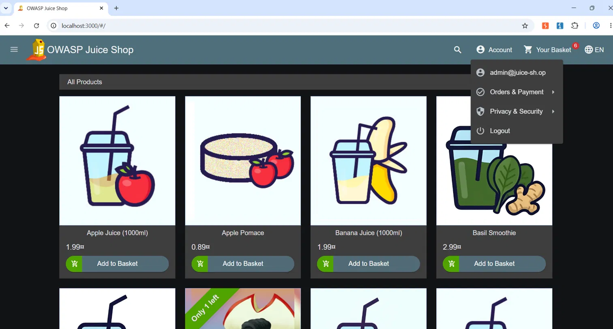
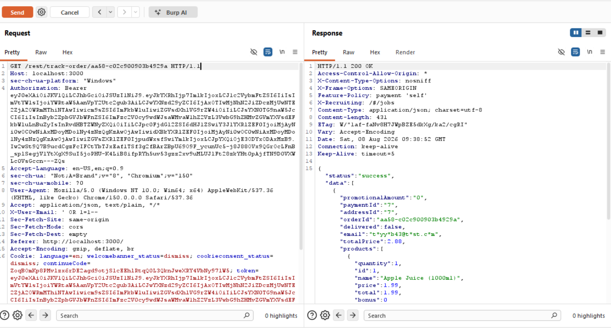

# Day 10 Report — Web Exploit Kill Chain (Weekend Project)

**Target:** OWASP Juice Shop (local Docker instance)
**Tools Used:** Browser (manual testing), Burp Suite Community Edition

---

## Kill Chain: SQL Injection → IDOR (Authentication Bypass leading to Cross-User Data Exposure)

### Summary

| Field | Detail |
|---|---|
| **Chain Type** | Multi-stage exploit — Broken Authentication chained into Broken Access Control |
| **Stage 1** | SQL Injection — Authentication Bypass (`POST /rest/user/login`) |
| **Stage 2** | IDOR — Cross-user order data exposure (`GET /rest/track-order/{id}`) |
| **CWE** | CWE-89 (SQL Injection) chained with CWE-639 (IDOR) |
| **OWASP Top 10** | A03:2021 – Injection, A01:2021 – Broken Access Control |
| **CVSS 3.1 Score (chained impact)** | 9.1 (Critical) |
| **CVSS Vector** | AV:N/AC:L/PR:N/UI:N/S:C/C:H/I:H/A:N |
| **Severity** | Critical |
| **Status** | Confirmed |

### Description

Individually, the SQL Injection bug in the login form and the IDOR bug in the order tracking endpoint are each serious on their own. But chaining them together turns a single injection flaw into full, unauthenticated access to every user's private order data — no valid credentials needed at any point.

The chain works like this: an attacker with zero prior access uses the SQL Injection vulnerability to log in as the admin account without knowing any password. That alone is already a critical finding. But it doesn't stop there — once the attacker holds that admin session, the IDOR vulnerability on the order tracking endpoint becomes usable with a privileged token. The tracking endpoint doesn't check whether the requester actually owns the order being requested, so the attacker can now pull up *any* user's order history — email address, purchased items, totals — just by supplying an order ID, using a session they obtained without ever proving who they are.

This demonstrates the real risk of "kill chains": neither bug needs to be the most severe on its own. What matters is that the first vulnerability hands the attacker a foothold (an authenticated, privileged session), and the second vulnerability turns that foothold into broad data exposure across the entire user base.

### Stage 1 — SQL Injection: Authentication Bypass

1. Navigate to the Juice Shop login page.
2. In the Email field, submit the payload:
   ```
   ' OR 1=1--
   ```
   with any arbitrary value in the Password field.
3. The login query, built through raw string concatenation on the backend, gets manipulated so its `WHERE` clause always evaluates true and the password check is commented out entirely.
4. The app logs the attacker in as the first matching user in the database — in this case, `admin@juice-sh.op` — without ever validating a real password.
5. The attacker now holds a fully valid, authenticated admin session token (JWT).

**Evidence — Stage 1:**



### Stage 2 — IDOR: Using the Stolen Session to Access Another User's Data

1. Using the admin token obtained in Stage 1, the attacker sends a request to the order tracking endpoint with an order ID belonging to a completely different, legitimate user:
   ```
   GET /rest/track-order/aa58-c02c900903b4929a HTTP/1.1
   Authorization: Bearer <admin token from Stage 1>
   ```
2. The endpoint checks that the token is valid (authentication) but never checks that the admin account actually owns this specific order (authorization).
3. The response returns the full order belonging to a different user — their email address, the products they purchased, and the total amount paid — despite the admin account having no legitimate relationship to that order.

**Evidence — Stage 2:**



### Why This Chain Matters More Than Either Bug Alone

- On its own, the SQL Injection bug already grants unauthorized admin access — critical by itself.
- On its own, the IDOR bug requires an attacker to already have *some* valid account and a guessable/known order ID — a meaningful but slightly higher bar.
- Chained together, an attacker starting with **zero credentials** ends up with **unauthenticated read access to every user's order data** in the system. The SQLi removes the need for the attacker to have any account at all, and the IDOR removes any ownership boundary once they're in. The combined outcome (mass data exposure, zero prior access required) is more severe than what either bug's individual CVSS score suggests in isolation.

### Root Cause (Both Stages)

- **Stage 1:** The login query is built via raw string concatenation instead of parameterized queries, allowing user input to alter the query's logic.
- **Stage 2:** The order tracking endpoint checks authentication (is this a valid session?) but not authorization (does this session's user actually own the requested resource?).

Both root causes are independent failures, but they compound: fixing either one breaks the chain, but both need to be fixed since each represents its own standalone vulnerability.

### Remediation

**Stage 1 fix — parameterized queries:**
```javascript
// Bad - raw string concatenation, vulnerable to SQL Injection
const query = `SELECT * FROM Users WHERE email = '${email}' AND password = '${password}'`;

// Good - parameterized query, input is always treated as data
const query = 'SELECT * FROM Users WHERE email = ? AND password = ?';
db.query(query, [email, password], (err, results) => { /* ... */ });
```

**Stage 2 fix — server-side ownership check:**
```javascript
// Bad - no ownership check, any valid session can access any order
router.get('/rest/track-order/:id', authenticate, async (req, res) => {
  const order = await Order.findOne({ where: { orderId: req.params.id } });
  res.json({ status: 'success', data: [order] });
});

// Good - verify the requesting user owns this specific order
router.get('/rest/track-order/:id', authenticate, async (req, res) => {
  const order = await Order.findOne({ where: { orderId: req.params.id } });

  if (!order) {
    return res.status(404).json({ status: 'error', message: 'Order not found' });
  }

  if (order.userId !== req.user.id) {
    return res.status(403).json({ status: 'error', message: 'Access denied' });
  }

  res.json({ status: 'success', data: [order] });
});
```

Fixing Stage 1 alone would prevent the attacker from ever obtaining a valid session in the first place, cutting the chain off at the root. Fixing Stage 2 alone would still leave the SQLi as a critical standalone bug, but would at least contain the blast radius so that even a compromised session couldn't be used to pull other users' data. Both fixes are necessary — defense in depth means neither vulnerability should be left unpatched just because the other one is fixed.

### References

- CWE-89: https://cwe.mitre.org/data/definitions/89.html
- CWE-639: https://cwe.mitre.org/data/definitions/639.html
- OWASP SQL Injection Prevention Cheat Sheet: https://cheatsheetseries.owasp.org/cheatsheets/SQL_Injection_Prevention_Cheat_Sheet.html
- OWASP Broken Access Control Cheat Sheet: https://cheatsheetseries.owasp.org/cheatsheets/Access_Control_Cheat_Sheet.html
- OWASP Top 10 2021 - A01: https://owasp.org/Top10/A01_2021-Broken_Access_Control/
- OWASP Top 10 2021 - A03: https://owasp.org/Top10/A03_2021-Injection/
