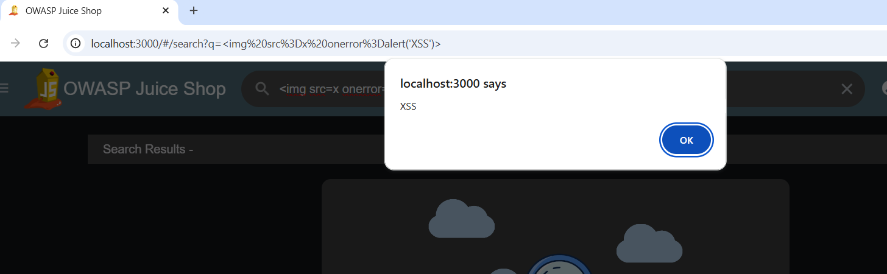
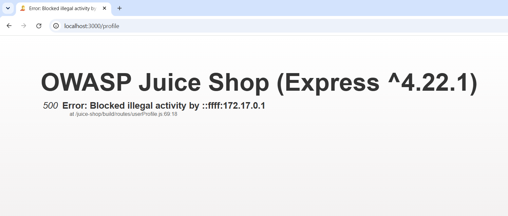

# Day 7 Report — Cross-Site Scripting (XSS) & Input Sanitization

**Target:** OWASP Juice Shop (local Docker instance)
**Tools Used:** Browser (manual testing), Burp Suite Community Edition

---

## Vulnerability 1: Reflected XSS via Search Bar

### Summary

| Field | Detail |
|---|---|
| **Vulnerability** | Reflected Cross-Site Scripting (XSS) |
| **Endpoint** | `GET /#/search?q=` |
| **CWE** | CWE-79 – Improper Neutralization of Input During Web Page Generation |
| **OWASP Top 10** | A03:2021 – Injection |
| **CVSS 3.1 Score** | 6.1 (Medium) |
| **CVSS Vector** | AV:N/AC:L/PR:N/UI:R/S:C/C:L/I:L/A:N |
| **Severity** | Medium |
| **Status** | Confirmed |

### Description

The product search feature takes whatever is typed into the search box and reflects it straight into the page without properly encoding it first. A plain `<script>alert('XSS')</script>` tag didn't fire (it looks like the app strips actual `<script>` tags), but switching to an event-handler based payload got around that filtering completely.

I typed the following into the search bar:
```html

```

The browser rendered this as an actual `` tag instead of treating it as plain text. Since the `src` attribute points to an invalid image (`x`), the image failed to load, which triggered the `onerror` event — and that ran the `alert('XSS')` JavaScript, popping up an alert box on the page.

This confirms the app is only filtering/blocking specific tag names like `<script>`, rather than properly encoding all HTML-significant characters in user input — which is a classic sign of a "blocklist" approach instead of proper output encoding, and it's exactly the kind of bypass the OWASP Prevention Cheat Sheet warns about.

### Steps to Reproduce

1. Open Juice Shop and click the search icon (top right).
2. In the search box, enter:
   ```html
   
   ```
3. Press Enter.
4. An alert box pops up on the page confirming the injected JavaScript executed.
5. The URL also reflects the raw, unencoded payload:
   ```
   localhost:3000/#/search?q=
   ```

### Evidence

Alert popup triggered from the search bar, with the payload visible in the URL and the broken image icon (proof the tag was rendered, not escaped):



### Root Cause

The search results page inserts the query parameter directly into the DOM without HTML-encoding characters like `<`, `>`, and `=`. It seems the app only checks for and strips literal `<script>` tags rather than encoding output generically — so any payload that doesn't rely on a `<script>` tag (like an `` tag with an `onerror` handler) sails right through.

### Impact

- An attacker could craft a malicious link containing this payload and send it to a victim (via email, chat, etc.). If the victim clicks it while logged in, arbitrary JavaScript runs in their browser session.
- This could be used to steal session tokens, perform actions on the victim's behalf, deface the page, or redirect them to a phishing site — though for this test only a harmless `alert()` PoC was used, per the task's "No Malware" rule.
- Because it's reflected (not stored), it requires the victim to click a crafted link, which lowers real-world severity somewhat compared to stored XSS, but it's still a legitimate injection vector.

### Remediation

Filtering out specific tags like `<script>` is not enough — the correct fix is to properly **encode output** based on the context it's rendered in, rather than trying to blocklist "dangerous" tags. Escaping should happen wherever user input gets inserted into HTML.

```javascript
// Bad - relies on stripping specific tags, easy to bypass
function sanitize(input) {
  return input.replace(/<script.*?>.*?<\/script>/gi, '');
}

// Good - encode HTML-significant characters generically
function encodeHTML(input) {
  return input
    .replace(/&/g, '&amp;')
    .replace(/</g, '&lt;')
    .replace(/>/g, '&gt;')
    .replace(/"/g, '&quot;')
    .replace(/'/g, '&#039;');
}

// Even better - use a well-tested library instead of hand-rolled encoding
const DOMPurify = require('dompurify');
const cleanOutput = DOMPurify.sanitize(userInput);
```

On the frontend (Angular, in Juice Shop's case), avoid using `[innerHTML]` bindings or `bypassSecurityTrustHtml()` on anything derived from user input — let Angular's built-in sanitization handle it by default instead of overriding it.

### References

- CWE-79: https://cwe.mitre.org/data/definitions/79.html
- OWASP XSS Prevention Cheat Sheet: https://cheatsheetseries.owasp.org/cheatsheets/Cross_Site_Scripting_Prevention_Cheat_Sheet.html
- OWASP Top 10 2021 - A03: https://owasp.org/Top10/A03_2021-Injection/

---

## Vulnerability 2 (Bonus Finding): Verbose Error Message / Information Disclosure

### Summary

| Field | Detail |
|---|---|
| **Vulnerability** | Verbose Error Message leaking internal server details |
| **Endpoint** | `/profile` |
| **CWE** | CWE-209 – Generation of Error Message Containing Sensitive Information |
| **OWASP Top 10** | A05:2021 – Security Misconfiguration |
| **CVSS 3.1 Score** | 5.3 (Medium) |
| **CVSS Vector** | AV:N/AC:L/PR:N/UI:N/S:U/C:L/I:N/A:N |
| **Severity** | Low-Medium |
| **Status** | Confirmed |

### Description

While testing an XSS payload against the profile name field, the app didn't execute the script — instead, it triggered a server-side block that returned a full, unhandled error page. That error page leaked internal implementation details that shouldn't be visible to a regular user, including the exact Express.js version and an internal file path.

### Steps to Reproduce

1. Log in and navigate to the profile update page (`/profile`).
2. Submit an XSS payload (e.g. ``) in the name field.
3. The server returns a 500 error page instead of a generic failure message, showing:
   ```
   OWASP Juice Shop (Express ^4.22.1)
   500 Error: Blocked illegal activity by ::ffff:172.17.0.1
   at /juice-shop/build/routes/userProfile.js:69:18
   ```

### Evidence

Error page showing internal framework version and file path:



### Root Cause

The app's server-side input filter did correctly catch and block the malicious payload here (which is good), but the failure path isn't handled gracefully — instead of returning a clean, generic error response, it lets the default Express error handler render a full stack trace and internal path straight to the browser.

### Impact

- Reveals the exact backend framework and version (`Express ^4.22.1`), which an attacker could use to look up known vulnerabilities for that specific version.
- Exposes internal file/folder structure (`/juice-shop/build/routes/userProfile.js`), giving an attacker a partial map of the server's code layout — useful reconnaissance for further attacks.
- On its own this isn't directly exploitable, but it lowers the bar for an attacker doing reconnaissance before a more targeted attack.

### Remediation

Never let default framework error handlers render to production users. Catch errors explicitly and return a generic message, logging the full details server-side only.

```javascript
// Bad - default Express error handler exposes stack traces
app.use((err, req, res, next) => {
  res.status(500).send(err.stack);
});

// Good - generic response to the client, full details only in server logs
app.use((err, req, res, next) => {
  console.error(err); // full details logged internally, never sent to client
  res.status(500).json({ status: 'error', message: 'Something went wrong. Please try again.' });
});
```

Also make sure `NODE_ENV=production` is set in production deployments, since many frameworks (including Express) automatically suppress verbose error output when not running in development mode.

### References

- CWE-209: https://cwe.mitre.org/data/definitions/209.html
- OWASP Top 10 2021 - A05: https://owasp.org/Top10/A05_2021-Security_Misconfiguration/
