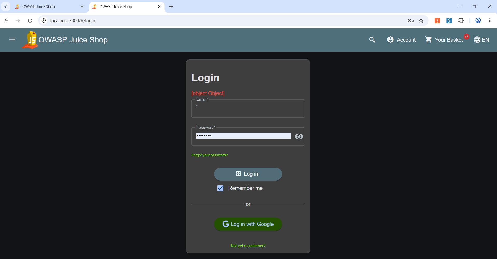
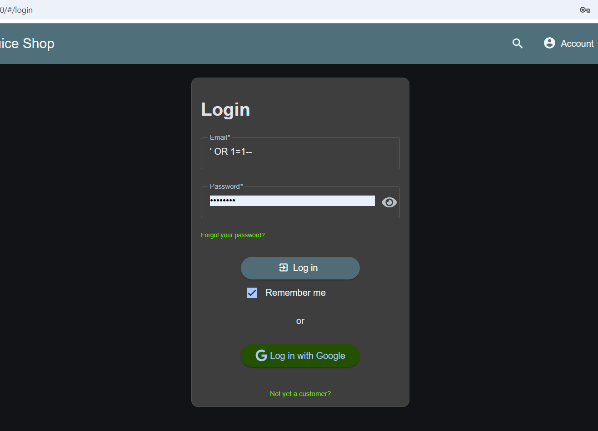

# Day 8 Report — SQL Injection (SQLi) & Database Security

**Target:** OWASP Juice Shop (local Docker instance)
**Tools Used:** Browser (manual testing), Burp Suite Community Edition

---

## Vulnerability: SQL Injection — Authentication Bypass via Login Form

### Summary

| Field | Detail |
|---|---|
| **Vulnerability** | SQL Injection (Authentication Bypass) |
| **Endpoint** | `POST /rest/user/login` |
| **CWE** | CWE-89 – Improper Neutralization of Special Elements used in an SQL Command (SQL Injection) |
| **OWASP Top 10** | A03:2021 – Injection |
| **CVSS 3.1 Score** | 9.8 (Critical) |
| **CVSS Vector** | AV:N/AC:L/PR:N/UI:N/S:U/C:H/I:H/A:H |
| **Severity** | Critical |
| **Status** | Confirmed |

### Description

The login form builds its database query by directly concatenating whatever is typed into the email field, without using parameterized queries or any input sanitization. This makes it possible to inject SQL syntax straight into the query and manipulate its logic — in this case, to bypass authentication entirely and log in as any user, including the admin, without knowing their password.

I first tested this by submitting a single quote (`'`) in the email field, which broke the query's syntax and produced a malformed, non-standard error (`[object Object]` on the frontend) instead of the normal "Invalid email or password" message. That confirmed the input was reaching the database layer unsanitized.

From there, I submitted the classic authentication bypass payload:
```
' OR 1=1--
```
in the email field, with any arbitrary value in the password field. The app logged me in immediately — no valid credentials were used, and the session that came back belonged to `admin@juice-sh.op`, the first user in the database.

### Steps to Reproduce

1. Go to the Juice Shop login page (`/#/login`).
2. In the Email field, enter a single quote: `'` — with any value in the password field. Submit.
3. Observe the malformed error response (`[object Object]`) instead of a normal login failure message — this indicates the input is breaking a raw SQL query.
4. Clear the email field and enter the payload:
   ```
   ' OR 1=1--
   ```
5. Enter any arbitrary value in the password field (e.g. `test123`).
6. Click Login.
7. The app redirects to the products page, logged in — no error, no valid credentials used.
8. Click the Account menu (top right) — it shows the logged-in account as `admin@juice-sh.op`, confirming a full authentication bypass into an administrator account.

### Evidence

Initial probe with a single quote, producing a malformed error that hints at unsanitized input reaching the query:



Login form submitted with the authentication bypass payload:



Confirmed login as `admin@juice-sh.op` after submitting the payload, with no valid password:


### Root Cause

The backend is very likely building the login query through raw string concatenation, something along these lines:

```javascript
const query = `SELECT * FROM Users WHERE email = '${email}' AND password = '${password}'`;
```

Because the `email` value is inserted directly into the query string, the payload `' OR 1=1--` changes the query's actual logic. Breaking it down:

- The first `'` closes the string that was supposed to hold the email address.
- `OR 1=1` is always true, so the `WHERE` clause matches every row in the `Users` table regardless of the actual email/password.
- `--` comments out the rest of the original query (including the password check), so the password field is never even evaluated.

The effective query the database ends up running looks like:
```sql
SELECT * FROM Users WHERE email = '' OR 1=1--' AND password = 'anything'
```
Since the query returns the first matching row and no password check occurs, whichever user record appears first in the table (in this case, the admin account) gets logged into.

### Impact

- Complete authentication bypass — any unauthenticated attacker can log in as any user, including admin, without needing valid credentials.
- Full compromise of confidentiality, integrity, and availability of the application, since admin access typically unlocks user management, order data, and other sensitive functionality.
- SQL Injection in a login form is one of the most severe web vulnerabilities possible, since it undermines the entire authentication mechanism the rest of the app's security depends on.
- Depending on the underlying database and how queries elsewhere in the app are built, similar injection points could exist in other forms (search, profile updates, etc.), meaning this is likely not an isolated issue.

### Remediation

The fix is to never build SQL queries by concatenating user input directly into the query string. Instead, use **prepared statements / parameterized queries**, which treat user input strictly as data — never as executable SQL — regardless of what characters it contains.

```javascript
// Bad - raw string concatenation, vulnerable to SQL Injection
const query = `SELECT * FROM Users WHERE email = '${email}' AND password = '${password}'`;
db.query(query, (err, results) => {
  // ...
});

// Good - parameterized query using placeholders
const query = 'SELECT * FROM Users WHERE email = ? AND password = ?';
db.query(query, [email, password], (err, results) => {
  // the database driver handles safe escaping — user input can never
  // change the structure of the query, no matter what characters it contains
});
```

If using an ORM like Sequelize (which Juice Shop uses), the equivalent safe approach is to rely on its built-in parameter binding instead of raw queries:

```javascript
// Good - Sequelize automatically parameterizes this
const user = await User.findOne({
  where: { email: email, password: hashedPassword }
});
```

Additionally:
- Passwords should always be hashed (e.g. with bcrypt) and compared as hashes, never stored or compared as plaintext.
- Generic error messages should be returned to the client on login failure, without leaking backend exception details (`[object Object]` itself is also a minor information disclosure issue worth cleaning up).

### References

- CWE-89: https://cwe.mitre.org/data/definitions/89.html
- OWASP SQL Injection Prevention Cheat Sheet: https://cheatsheetseries.owasp.org/cheatsheets/SQL_Injection_Prevention_Cheat_Sheet.html
- OWASP Top 10 2021 - A03: https://owasp.org/Top10/A03_2021-Injection/
- PortSwigger - SQL Injection: https://portswigger.net/web-security/sql-injection
