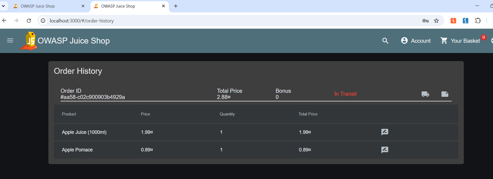

# Day 9 Report — Broken Access Control & IDOR

**Target:** OWASP Juice Shop (local Docker instance)
**Tools Used:** Browser (manual testing), Burp Suite Community Edition

---

## Vulnerability: IDOR on Order Tracking Endpoint

### Summary

| Field | Detail |
|---|---|
| **Vulnerability** | Insecure Direct Object Reference (IDOR) |
| **Endpoint** | `GET /rest/track-order/{orderId}` |
| **CWE** | CWE-639 – Authorization Bypass Through User-Controlled Key |
| **OWASP Top 10** | A01:2021 – Broken Access Control |
| **CVSS 3.1 Score** | 7.1 (High) |
| **CVSS Vector** | AV:N/AC:L/PR:L/UI:N/S:U/C:H/I:N/A:N |
| **Severity** | High |
| **Status** | Confirmed |

### Description

The order tracking endpoint lets any logged-in user look up an order by its ID, but it never checks whether that order actually belongs to them. As long as you know (or can guess) a valid order ID, you can pull up someone else's full order details — email, products, total price — using your own account's token.

To prove this wasn't just a coincidence, I created a real order under a completely different account (`tayyab43@test.com`), noted down its exact order ID from that account's own Order History page, and then used a different, unrelated session (an admin token from an earlier SQLi test) to request that same order ID through the track-order endpoint. It worked — the admin session pulled back the other user's full order, no questions asked.

### Steps to Reproduce

1. Log in as User A, place an order, and note the exact order ID from Order History (e.g. `aa58-c02c900903b4929a`).
2. Using a different session/account (User B), send:
   ```
   GET /rest/track-order/aa58-c02c900903b4929a HTTP/1.1
   Host: localhost:3000
   Authorization: Bearer <User B's token>
   ```
3. The response returns `200 OK` with User A's complete order details — email, product list, quantities, and total price — despite the request being made with User B's credentials.

### Evidence

User A's own order in their Order History, showing the real order ID used for the test:



Same order ID successfully retrieved using a different user's (admin) token, returning User A's full order data:


### Root Cause

The `/rest/track-order/:id` route looks up the order purely by its ID and returns whatever it finds, without ever comparing the order's owner to the ID of the user making the request. It checks that the requester is *authenticated* (has a valid token) but never checks that they're *authorized* to view that specific order — this is the classic distinction between authentication and authorization that IDOR bugs exploit.

### Impact

- Any authenticated user can view any other user's order details — including their email address, what they purchased, and how much they paid — just by knowing or guessing an order ID.
- Order IDs in this app don't look sequential/predictable on the surface, but relying on IDs being "hard to guess" instead of enforcing real authorization is not a valid security control — this is exactly the "security by obscurity" trap the task's reading material warned about.
- If an attacker could enumerate or leak order IDs from anywhere else in the app (logs, other endpoints, referral links, etc.), this becomes a direct path to mass data exposure across all users' orders.

### Remediation

The fix has to happen on the server side: before returning any order, check that the order's owner matches the ID of the user making the request. Relying on the ID being long or random is not a substitute for this check.

```javascript
// Bad - returns the order to anyone who knows the ID, no ownership check
router.get('/rest/track-order/:id', authenticate, async (req, res) => {
  const order = await Order.findOne({ where: { orderId: req.params.id } });
  res.json({ status: 'success', data: [order] });
});

// Good - verify the requesting user actually owns this order
router.get('/rest/track-order/:id', authenticate, async (req, res) => {
  const order = await Order.findOne({ where: { orderId: req.params.id } });

  if (!order) {
    return res.status(404).json({ status: 'error', message: 'Order not found' });
  }

  if (order.userId !== req.user.id) {
    return res.status(403).json({ status: 'error', message: 'Access denied' });
  }

  res.json({ status: 'success', data: [order] });
});
```

This same pattern — checking `request.user.id` against the resource's actual owner before returning data — needs to be applied consistently across every endpoint that takes a user-supplied ID (profile lookups, basket access, file downloads, etc.), not just this one.

### References

- CWE-639: https://cwe.mitre.org/data/definitions/639.html
- OWASP Broken Access Control Cheat Sheet: https://cheatsheetseries.owasp.org/cheatsheets/Access_Control_Cheat_Sheet.html
- OWASP Top 10 2021 - A01: https://owasp.org/Top10/A01_2021-Broken_Access_Control/
- PortSwigger - Insecure Direct Object References: https://portswigger.net/web-security/access-control/idor
