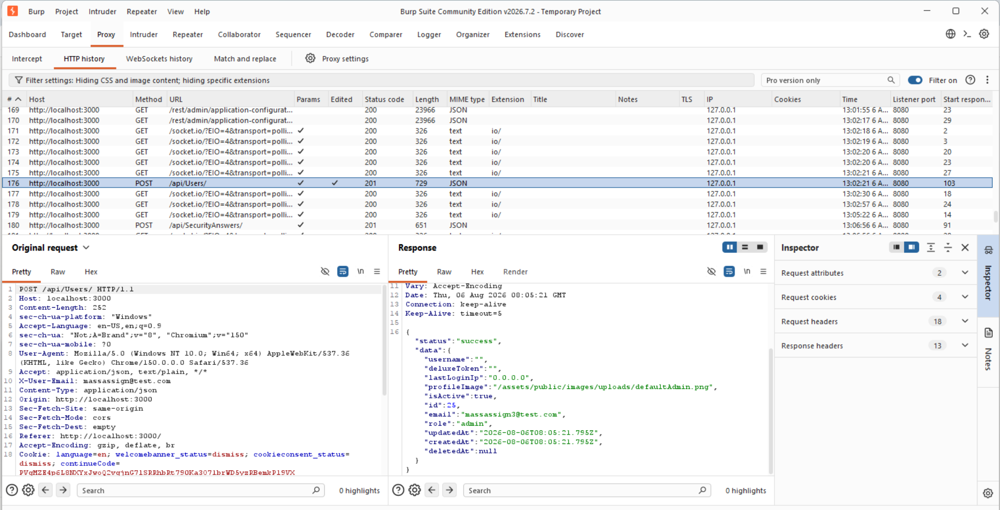
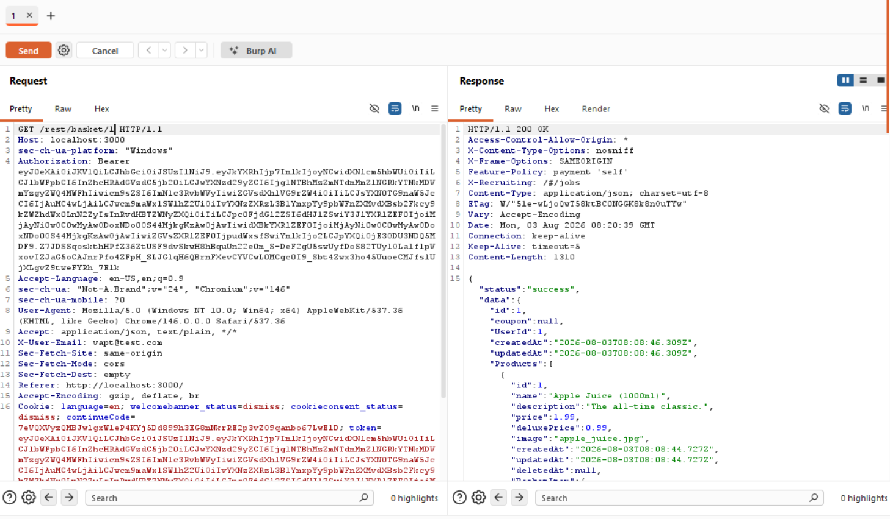

# Weekend VAPT Report — OWASP Juice Shop (Sandbox)

**Target:** OWASP Juice Shop (local Docker instance)
**Tools Used:** Burp Suite Community Edition
**Date:** 11–12 July (Weekend VAPT Sprint, following Week 1 Day 5)

---

## Vulnerability 1: Mass Assignment leading to Privilege Escalation

### Summary

| Field | Detail |
|---|---|
| **Vulnerability** | Mass Assignment (Privilege Escalation via unauthenticated registration) |
| **Endpoint** | `POST /api/Users/` |
| **CWE** | CWE-915 – Improperly Controlled Modification of Dynamically-Determined Object Attributes |
| **OWASP Top 10** | A08:2021 – Software and Data Integrity Failures (also maps to A01:2021 – Broken Access Control) |
| **CVSS 3.1 Score** | 8.1 (High) |
| **CVSS Vector** | AV:N/AC:L/PR:N/UI:N/S:U/C:H/I:H/A:N |
| **Severity** | High |
| **Status** | Confirmed |

### Description

The user registration endpoint (`/api/Users/`) doesn't restrict which fields it accepts in the request body. Normally the registration form only sends email, password, passwordRepeat, securityQuestion and securityAnswer. But since the backend seems to bind the incoming JSON directly to the User model without whitelisting fields, it's possible to add extra parameters that aren't meant to be user-controlled — like `role`.

I tested this by intercepting a normal registration request in Burp and manually adding a `role: "admin"` field to the JSON body before forwarding it. The server accepted it without any validation error and created the account with admin privileges — this on a completely unauthenticated endpoint, meaning literally anyone can register themselves as an admin.

### Steps to Reproduce

1. Open Juice Shop registration page (`/#/register`) with Burp Suite proxy running and Intercept turned ON.
2. Fill the form normally (email, password, security question/answer) and hit Register.
3. In Burp Proxy, let the socket.io polling requests pass through until the actual `POST /api/Users/` request shows up in Intercept.
4. In the request body, add an extra field after `securityAnswer`:
   ```json
   "role": "admin"
   ```
5. Forward the request.
6. Check the response — status code was `201 Created`, and the returned user object included `"role": "admin"` in the JSON body.

### Evidence

Request with injected `role` field, and the response confirming the account was created with admin role:



Response body observed:
```json
{
  "status": "success",
  "data": {
    "username": "",
    "id": 25,
    "email": "massassign3@test.com",
    "role": "admin",
    "profileImage": "/assets/public/images/uploads/defaultAdmin.png",
    ...
  }
}
```

### Root Cause

The registration controller/service is likely mapping the request body straight onto the Sequelize User model (something like `User.create(req.body)`) instead of picking out only the fields that are actually supposed to be user-settable. Since `role` exists as a column on the model, it gets silently accepted along with everything else.

### Impact

- Any unauthenticated user can create an admin account for themselves by just adding one extra field to a normal registration request.
- Full privilege escalation with zero prior access — no login needed, no existing account needed.
- Depending on what admin access unlocks in the app (admin panel, user management, product management etc.), this can lead to a complete compromise of the application's business logic.

### Remediation

Don't trust the client to tell you what fields are safe to set. Explicitly whitelist the fields allowed during registration instead of passing the whole request body to the model.

```javascript
// Bad - vulnerable to mass assignment
const newUser = await User.create(req.body);

// Good - explicit whitelist
const { email, password, passwordRepeat, securityQuestion, securityAnswer } = req.body;

const newUser = await User.create({
  email,
  password,
  passwordRepeat,
  securityQuestion,
  securityAnswer,
  role: 'customer' // hardcoded, never taken from user input
});
```

Alternatively, use a DTO/schema validation library (like Joi or Zod) to strictly define and reject any unexpected fields in the incoming request before it ever reaches the model layer.

---

## Vulnerability 2: IDOR (Broken Object Level Authorization) on Basket Endpoint

### Summary

| Field | Detail |
|---|---|
| **Vulnerability** | Insecure Direct Object Reference (IDOR) |
| **Endpoint** | `GET /rest/basket/{id}` |
| **CWE** | CWE-639 – Authorization Bypass Through User-Controlled Key |
| **OWASP Top 10** | A01:2021 – Broken Access Control |
| **CVSS 3.1 Score** | 7.1 (High) |
| **CVSS Vector** | AV:N/AC:L/PR:L/UI:N/S:U/C:H/I:N/A:N |
| **Severity** | High |
| **Status** | Confirmed |

### Description

The basket endpoint takes a basket ID directly in the URL path and returns the associated basket data, without checking whether the basket actually belongs to the currently authenticated user. Every logged-in user gets a valid JWT, and that same token can be used to request any basket ID just by changing the number in the URL — the server doesn't verify ownership before returning the data.

I logged in as my own test account (`vapt@test.com`, UserId 1) and requested my own basket (`/rest/basket/1`) to confirm it returned my data. Then, using the exact same token, I changed the URL to point to a different basket ID belonging to another user, and the server happily returned that user's basket contents too.

### Steps to Reproduce

1. Log in to Juice Shop as a test account and capture the JWT from the login response (or from the Authorization header on subsequent requests).
2. Send `GET /rest/basket/1` with your own token via Burp Repeater — confirm the response matches your own `UserId`.
3. Change the URL to a different basket ID, e.g. `GET /rest/basket/2`, keeping the exact same Authorization header (your own token, unchanged).
4. Send the request.
5. Observe that the response returns `200 OK` with basket data belonging to a different `UserId` — meaning another user's basket data (products, quantities) is exposed to an account that has no relation to it.

### Evidence

Request sent with own token, response showing another user's basket data returned successfully:



### Root Cause

The `/rest/basket/:id` route only checks whether the JWT is valid (i.e., is the requester logged in), but doesn't check whether the `UserId` on the requested basket matches the `UserId` encoded in the requester's own token. This is a classic missing object-level authorization check — authentication is being confused with authorization.

### Impact

- Any authenticated user, regardless of their own account, can view (and potentially modify) any other user's basket by just guessing or iterating basket IDs, which are simple sequential integers.
- Exposes what other users are shopping for, quantities, and potentially discount/coupon data tied to their basket.
- If PUT/DELETE on the same endpoint isn't properly authorized either, this could extend beyond information disclosure into unauthorized modification of another user's data.

### Remediation

Add an explicit ownership check on the server side before returning (or modifying) any basket, comparing the basket's `UserId` against the `UserId` extracted from the requester's own JWT — never trust the ID in the URL alone.

```javascript
// Bad - no ownership check
router.get('/rest/basket/:id', authenticate, async (req, res) => {
  const basket = await Basket.findByPk(req.params.id);
  res.json({ status: 'success', data: basket });
});

// Good - verify the basket belongs to the requester
router.get('/rest/basket/:id', authenticate, async (req, res) => {
  const basket = await Basket.findByPk(req.params.id);

  if (!basket || basket.UserId !== req.user.id) {
    return res.status(403).json({ status: 'error', message: 'Forbidden' });
  }

  res.json({ status: 'success', data: basket });
});
```

### References

- CWE-915: https://cwe.mitre.org/data/definitions/915.html
- CWE-639: https://cwe.mitre.org/data/definitions/639.html
- OWASP Mass Assignment Cheat Sheet: https://cheatsheetseries.owasp.org/cheatsheets/Mass_Assignment_Cheat_Sheet.html
- OWASP Top 10 2021 - A01: https://owasp.org/Top10/A01_2021-Broken_Access_Control/
- OWASP Top 10 2021 - A08: https://owasp.org/Top10/A08_2021-Software_and_Data_Integrity_Failures/
